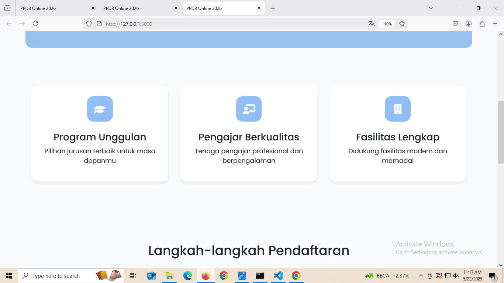
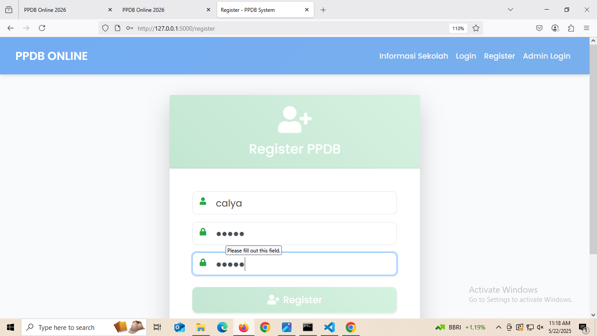
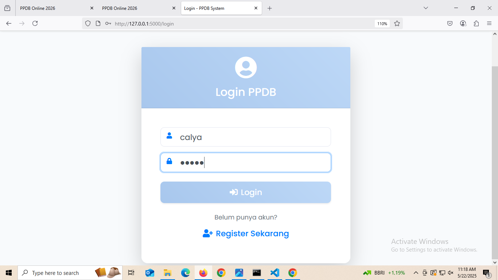
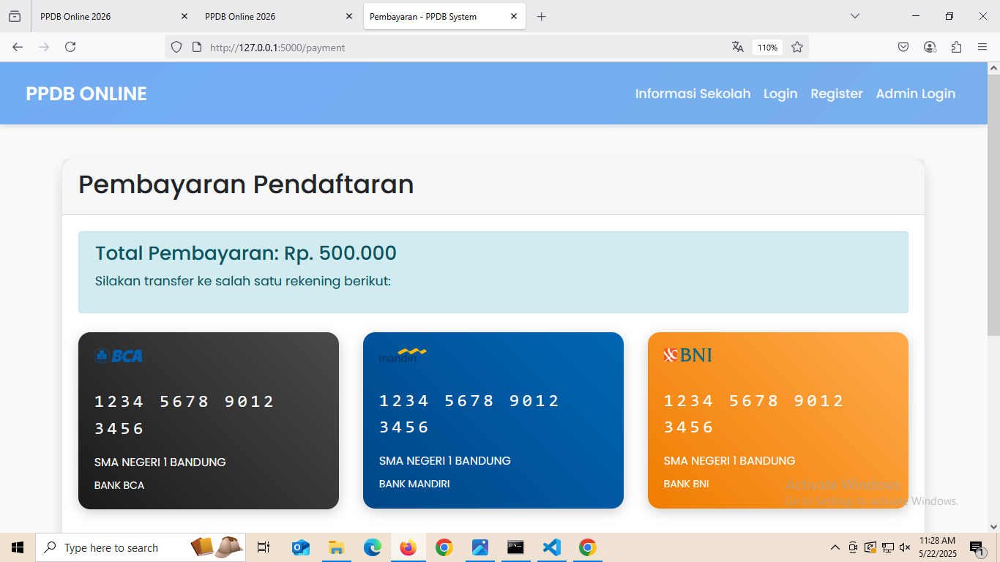
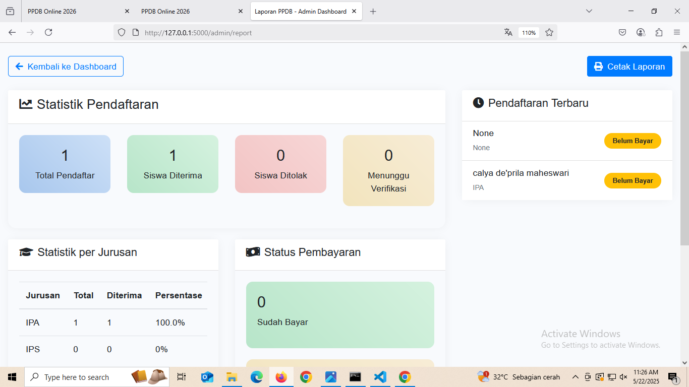
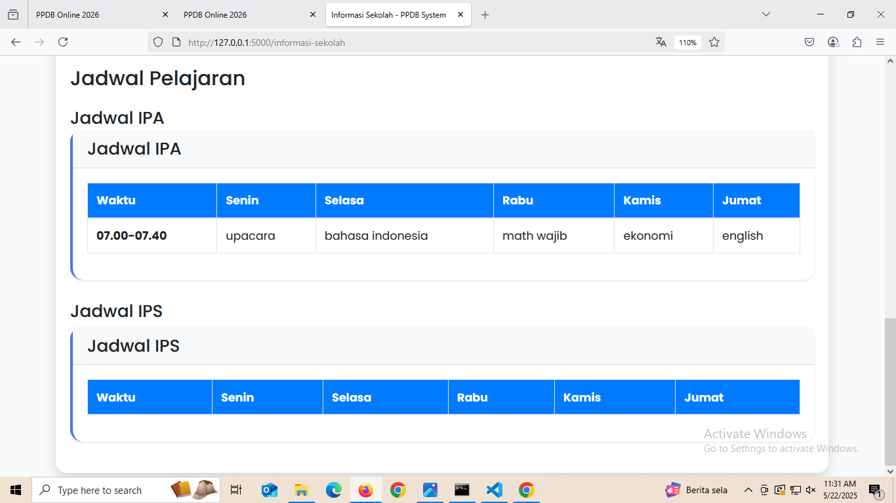
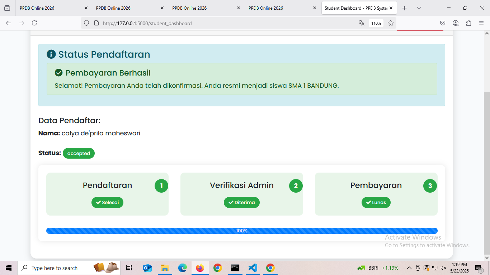

# Sistem PPDB Online SMA Negeri 1 Bandung

Sistem Penerimaan Peserta Didik Baru (PPDB) Online untuk SMA Negeri 1 Bandung dengan fitur pendaftaran, verifikasi, dan pembayaran.

## Fitur Utama

### Calon Siswa
1. Pendaftaran Akun
   - Registrasi username dan password
   - Login sistem
   - Dashboard siswa

2. Form Pendaftaran
   - Input data pribadi (nama, tempat lahir, jenis kelamin, agama, dll)
   - Input data orang tua (nama dan pekerjaan orang tua)
   - Pilihan jurusan (IPA/IPS)
   - Upload dokumen (ijazah dan foto)
   - Progress tracking pendaftaran

3. Status Pendaftaran
   - Tracking progress (Pendaftaran -> Verifikasi -> Pembayaran)
   - Notifikasi status pendaftaran
   - Status verifikasi admin

4. Pembayaran
   - Informasi rekening pembayaran
   - Upload bukti transfer
   - Status verifikasi pembayaran

### Admin
1. Dashboard Admin
   - Statistik pendaftaran
   - Data pendaftar
   - Manajemen user

2. Verifikasi Pendaftaran
   - Review data pendaftar
   - Verifikasi dokumen
   - Approval/Reject pendaftaran

3. Manajemen Jadwal
   - Input jadwal pelajaran
   - Edit jadwal
   - Hapus jadwal

4. Manajemen Pembayaran
   - Verifikasi bukti pembayaran
   - Update status pembayaran
   - Laporan pembayaran

## Teknologi

- Backend: Python Flask
- Database: SQLite
- Frontend: 
  - Bootstrap 4
  - jQuery
  - Font Awesome icons
- File Upload: Werkzeug

## Struktur Database

### Tabel User
- id (Primary Key)
- username
- password
- role (admin/user)
- status (pending/accepted/rejected)
- full_name
- gender
- agama
- phone
- address
- jurusan
- tempat_lahir
- asal_sekolah
- nama_ayah
- pekerjaan_ayah
- nama_ibu
- pekerjaan_ibu
- payment_status
- payment_proof

### Tabel Schedule
- id (Primary Key)
- jurusan
- waktu
- senin
- selasa
- rabu
- kamis
- jumat

## Instalasi

1. Clone repository
```bash
git clone [url-repository]
cd calya
```

2. Buat virtual environment
```bash
python -m venv venv
source venv/bin/activate  
venv\Scripts\activate    
```

3. Install dependencies
```bash
pip install -r requirements.txt
```

4. Siapkan database
```bash
flask db init
flask db migrate
flask db upgrade
```

5. Jalankan aplikasi
```bash
python app.py
```

## Penggunaan

### Login Admin
- Username: admin
- Password: admin123
- URL: /admin_login

### Register Siswa
1. Klik "Register" di halaman utama
2. Isi username dan password
3. Login dengan akun yang dibuat
4. Lengkapi form pendaftaran
5. Upload dokumen yang diperlukan
6. Tunggu verifikasi admin

### Alur Sistem
1. Siswa mendaftar akun
2. Siswa melengkapi data diri
3. Admin melakukan verifikasi
4. Jika diterima, siswa melakukan pembayaran
5. Admin verifikasi pembayaran
6. Proses selesai

## Kontribusi
1. Fork repository
2. Buat branch baru
3. Commit perubahan
4. Push ke branch
5. Buat Pull Request

## Lisensi
MIT License

## Screenshots

### Home Page & Informasi Awal

Halaman utama website PPDB yang menampilkan menu navigasi dan informasi pendaftaran.


Panduan langkah-langkah proses pendaftaran PPDB secara detail.


Informasi tentang kualitas dan prestasi sekolah.

### Registrasi & Login

Form registrasi akun baru untuk calon siswa.


Halaman login untuk siswa.


Halaman login khusus admin.

### Proses Pendaftaran

Tampilan setelah siswa berhasil mendaftar.


Form pengisian data pribadi calon siswa.


Notifikasi penerimaan siswa.


Notifikasi yang muncul ketika pendaftaran siswa ditolak oleh admin setelah proses verifikasi.

### Pembayaran

Halaman pembayaran setelah siswa diterima.


Form pengisian data pembayaran.


Detail informasi pembayaran.


Konfirmasi pengiriman bukti pembayaran.


Status verifikasi pembayaran.

### Panel Admin

Dashboard utama admin.


Tampilan data pendaftar di panel admin.


Detail data pendaftar yang dapat dikelola admin.


Manajemen status pendaftaran siswa.


Panel verifikasi bukti pembayaran oleh admin.


Laporan pembayaran yang telah masuk.


Halaman laporan keseluruhan sistem.

### Manajemen Jadwal

Halaman pengelolaan jadwal pelajaran.


Form penambahan jadwal baru.


Form edit jadwal pelajaran.


Tampilan jadwal pelajaran.


Halaman konfirmasi yang menunjukkan bahwa seluruh proses pendaftaran telah selesai dan berhasil dilakukan.
